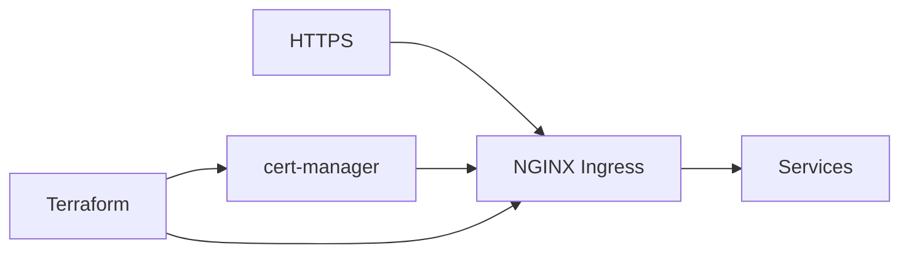

# NGINX Ingress + cert-manager (EKS)

[](LICENSE)
[](https://www.terraform.io/)
[](https://aws.amazon.com/)
[](https://github.com/ghcetraro/terraform_nginx_ingress_ssl/actions/workflows/ci.yml)

**Ingress NGINX con TLS automático (cert-manager) en EKS — dos módulos Terraform**

---

## El problema

Publicar servicios en EKS con HTTPS suele dividirse entre ingress controller y certificados; sin IaC, cada cluster queda distinto.

## La solución

Dos carpetas Terraform (`nginx-ingress/` y `cert-manager/`) para instalar el controller y emitir certificados de forma repetible.



---

## Características

| Área | Detalle |
|------|---------|
| **NGINX Ingress** | Controller en el cluster |
| **cert-manager** | TLS automático |
| **DNS/ACM ready** | Variables de zona y cluster |
| **Modular** | Aplicá cada componente por separado |
| **Ejemplos** | Carpeta `examples/` |

---

## Limitaciones y disclaimer

- Pensado como **punto de partida / referencia**: revisá roles IAM, redes y secretos antes de producción.
- Requiere **credenciales AWS** (recomendado SSO) y, en módulos EKS, acceso al cluster (kubeconfig / exec).
- Completá `locals` y variables según tu cuenta; los ejemplos usan valores ficticios.
- Software open source “as is” — probá primero en un ambiente no productivo.

---

## Stack

Terraform · EKS · NGINX Ingress · cert-manager

---

## Inicio rápido

### Requisitos

- Terraform CLI 1.x
- AWS CLI configurado (`aws sso login` o credenciales)
- Permisos de administración en la cuenta / cluster según el módulo

### Configuración

```bash
cp nginx-ingress/terraform.tfvars.example / cert-manager/terraform.tfvars.example terraform.tfvars   # ajustá path si hay submódulos
# Completar variables — no commitear terraform.tfvars
```

Valores de ejemplo: `nginx-ingress/terraform.tfvars.example` / `cert-manager/terraform.tfvars.example`

### Apply

```bash
cd nginx-ingress
cp terraform.tfvars.example terraform.tfvars
# Editar valores (cuenta, región, cluster, etc.)

terraform init
terraform plan
terraform apply
```
```bash
cd cert-manager
cp terraform.tfvars.example terraform.tfvars
# Editar valores (cuenta, región, cluster, etc.)

terraform init
terraform plan
terraform apply
```

---

## Documentación

- [Uso y despliegue](docs/uso.md)
- [Presentación / LinkedIn](docs/PRESENTACION.md)
- [Speech para LinkedIn](docs/speech-linkedin.md)
- [Changelog](CHANGELOG.md)
- [Contribuir](CONTRIBUTING.md)
- [Seguridad](SECURITY.md)

---

## Seguridad

**No commitees** `terraform.tfvars`, state, claves ni tokens. Usá `*.tfvars.example` como plantilla.

Ver [SECURITY.md](SECURITY.md).

---

## Licencia

[MIT](LICENSE) — Copyright (c) Gabriel Cetraro

---

## Autor

Proyecto open source de **Gabriel Cetraro** — automatización de infraestructura, AWS, Kubernetes y observabilidad.

Si te resulta útil, ⭐ en GitHub ayuda a darle visibilidad.
