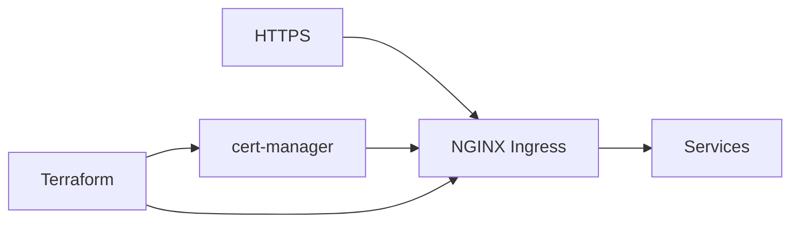

# Presentación — NGINX Ingress + cert-manager (EKS)

Material listo para publicar en **LinkedIn** (post + carrusel). Copiá cada sección como una diapositiva o bloque del post.

**Speech listo para copiar/pegar:** [speech-linkedin.md](speech-linkedin.md)

---

## Slide 1 — Hook

### HTTPS en EKS con NGINX + cert-manager, en dos applies

Presento **NGINX Ingress + cert-manager (EKS)**: Ingress NGINX con TLS automático (cert-manager) en EKS — dos módulos Terraform

Terraform · EKS · NGINX Ingress · cert-manager

---

## Slide 2 — El dolor

- Ingress sin certificados
- cert-manager instalado “a mano”
- Entornos que no se parecen

**Automatizar esto no es lujo — es repetibilidad.**

---

## Slide 3 — Qué hace

---

## Slide 4 — Características

- **NGINX Ingress**: Controller en el cluster
- **cert-manager**: TLS automático
- **DNS/ACM ready**: Variables de zona y cluster
- **Modular**: Aplicá cada componente por separado
- **Ejemplos**: Carpeta `examples/`

---

## Slide 5 — Cómo probarlo

1. Cloná el repo
2. Copiá `terraform.tfvars.example` → `terraform.tfvars`
3. `terraform init && plan && apply`
4. Revisá outputs / recursos en la consola AWS

Repo: `https://github.com/ghcetraro/terraform_nginx_ingress_ssl`

---

## Slide 6 — CTA

Open source · MIT · listo para adaptar a tu cuenta.

⭐ Si te sirve, estrella en GitHub y compartí feedback.

`https://github.com/ghcetraro/terraform_nginx_ingress_ssl`
